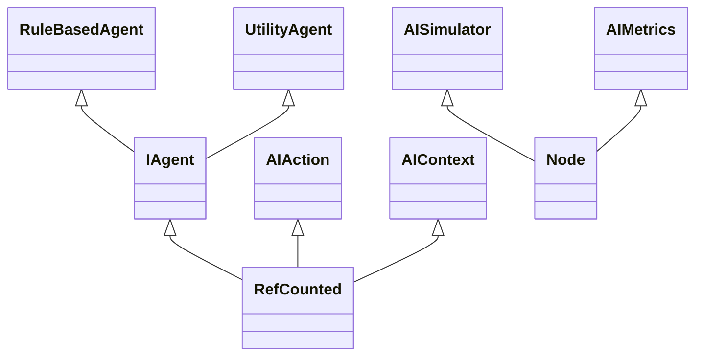

# IAV26-TristanAlvarez

> [!NOTE]
> Versión: 1

<!-- > [!NOTE]
> Changelog: 
- [Instalación y uso](#instalación-y-uso), [Punto de partida](#punto-de-partida), [Planteamiento del problema](#planteamiento-del-problema)
  - Actualizados según el cambio del enunciado y plantilla.
- [Diseño de la solución](#diseño-de-la-solución)
  - Ampliada y clarificada la explicación sobre el diseño de la solución.
  - Rellenadas las transiciones entre estados en el diagrama de estados
  - Redactadas las explicaciones de los comportamientos del agente en cada estado.
- [Implementación](#implementación)
  - Rellenada tabla de tareas.
- [Pruebas y métricas](#pruebas-y-métricas)
  - Rellenada sección de métricas y vídeo. -->

## Índice
1. [Autores](#autores)
1. [Resumen](#resumen)
1. [Instalación y uso](#instalación-y-uso)
1. [Introducción](#introducción)
1. [Punto de partida](#punto-de-partida)
1. [Desarrollo de la partida](#desarrollo-de-la-partida)
1. [Planteamiento del problema](#planteamiento-del-problema)
1. [Diseño de la solución](#diseño-de-la-solución)
1. [Implementación](#implementación)
1. [Pruebas y métricas](#pruebas-y-métricas)
1. [Conclusiones](#conclusiones)
1. [Licencia](#licencia)
1. [Referencias](#referencias)
<!-- 1. [Ampliaciones](#ampliaciones) -->

## Autores
- Cynthia Tristán Álvarez [@cyntrist](https://github.com/cyntrist)

## Resumen
Prototipo de combate táctico por turnos en Godot, basado en la serie *Tactics RPG* de The Liquid Fire y a su vez en su adaptación a Godot por *7thSage*. El estado base incluye tablero con alturas, selección de unidades, movimiento por casillas, control de cámara y una máquina de estados para el flujo principal del combate, que cuenta con tanto ataques cuerpo a cuerpo y a distancia como con habilidades, estadísticas y turnos.

El objetivo académico es extender esta base con inteligencia artificial para enemigos implementando dos tipos de sistemas: sistemas basados en reglas y sistemas de utilidad, permitiendo evaluar decisiones tácticas en un entorno controlado. El objetivo práctico es comparar los dos enfoques de IA enfrentándolos entre sí en batallas automáticas y analizando métricas de rendimiento y eficacia.

## Instalación y uso
Todo el contenido del proyecto está disponible en este repositorio, con **Godot 4.6** siendo la versión con la que ejecutar el proyecto.

## Introducción
El proyecto se enmarca en la asignatura de Inteligencia Artificial para Videojuegos del Grado en Desarrollo de Videojuegos (UCM). La propuesta parte de un prototipo táctico por turnos para estudiar, implementar y evaluar técnicas de toma de decisiones en agentes no jugadores. 

La referencia principal es la serie *Tactics RPG* de The Liquid Fire y, en particular, la serie *Godot Tactics RPG*. Esta elección permite trabajar sobre una base técnica conocida (tablero, unidades, movimiento, habilidades y estados de batalla) y centrar el esfuerzo en la capa de IA, campo que la serie de tutoriales aún no cubre, a diferencia de la versión original en Unity.

Este prototipo sirve para poner en práctica una de las formas de IA más fundamentales y entendibles de la historia de la inteligencia artificial, sistemas basados en reglas, junto a sistemas basados en utilidad como enfoque avanzado con mejor adaptación situacional. El resultado esperado es un sistema capaz de ejecutar combates tácticos con agentes autónomos, con comportamientos comparables y medibles dentro de un mismo entorno de juego.

## Punto de partida
Se ha implementado desde cero, siguiendo la serie de tutoriales en la que está basado el proyecto, la base sobre la trabajar, que consiste en:

* Un entorno isométrico 3D de combate en cuadrícula con distintas alturas entre unidades capaces de:
  * Moverse en un rango de celdas
  * Usar items
  * Equiparse distintos tipos de objetos 
  * Atacar cuerpo a cuerpo o con habilidades en un cierto rango. 
* La gestión de los turnos se resuelve en función de las estadísticas de las unidades. 
* Las unidades pueden fallar al atacar. 
* Al inicio del combate hay una conversación. 
* Hay habilidades que inflingen estados alterados que las unidades pueden sufrir.

Las unidades cuentan cada una con las siguientes estadísticas:

- *LVL*: Nivel
- *EXP*: Puntos de experiencia totales
- *HP*:  Puntos de vida actuales
- *MHP*: Puntos de vida máximos
- *MP*:  Puntos de magia actuales
- *MMP*: Puntos de magia máximos
- *ATK*: Ataque físico
- *DEF*: Defensa física
- *MAT*: Ataque mágico
- *MDF*: Defensa mágica
- *EVD*: Evasión
- *RES*: Resistencia a efectos adversos
- *SPD*: Velocidad con la que recupera su turno
- *MOV*: Rango en número de casillas de movimiento
- *JMP*: Altura máxima capaz de saltar al moverse

Según su movimiento, una unidad ser:

- **Terrestre**: en su movimiento puede saltar diferencias de altura +/- 1.
- **Volador**: en su movimiento ignora las alturas, pero necesita que haya suelo en todo su camino.
- **Teleportante**: en su movimiento ignora tanto las alturas como la necesidad de suelo entre su inicio y su final de trayecto.

Según su tipo, una unidad podrá ser:

- **Guerrera**: Mayor MHP y ATK.
- **Ladrona**: Mayor EVD y SPD.
- **Maga**: Mayor MMP y MAT.

Cada clase tiene su propio crecimiento de estadísticas predefinidio y serializado.

Los efectos adversos que se pueden inflingir son: 
- **Blind**: reduce la precisión de ataque.
- **Poison**: aplica daño periódico.
- **Haste**: acelera la recuperación del turno.
- **Slow**: retrasa la recuperación del turno.
- **Stop**: impide actuar durante su duración.

### Jerarquía de recursos
```text
GodotProject
├── addons
├── Data
|   ├── Conversations
|   |   └── Translations
|   ├── Jobs
|   └── Levels
├── Materials
├── Prefabs
├── Scenes
├── Scripts
|   ├── AI
|   |   └── TO-DO
|   ├── Common
|   |   ├── Input
|   |   ├── State Machine
|   |   └── UI
|   ├── Controller
|   |   └── Battle States
|   ├── Enums Exetentions
|   ├── Exceptions
|   |   └── Modifiers
|   ├── Model
|   ├── PreProduction
|   ├── Test
|   └── View Model Component
|       └── ...
├── Settings
└── Textures
```

### Estructura del proyecto
Dentro de `GodotProject` los recursos principales se organizan de la siguiente forma:

* *addons*: Plugins desarrollados para utilidades de preproducción y herramientas de creación del tablero en el editor.
* *Data*: Datos de juego serializados: mapas (`Levels`), clases (`Jobs`) y conversaciones (`Conversations` + `Translations` en CSV).
* *Materials*: Materiales usados por tablero, unidades e indicadores.
* *Prefabs*: Escenas reutilizables instanciables durante la partida.
* *Scenes*: Escenas principales de ejecución y pruebas visuales.
* [*Scripts*](https://github.com/cyntrist/IAV26-TristanAlvarez/tree/main/GodotProject/Scripts): Código del juego, separado por responsabilidad. Las principales:
* └── [**AI**](https://github.com/cyntrist/IAV26-TristanAlvarez/tree/main/GodotProject/Scripts/AI): lógica relacionada con la simulación y la inteligencia artificial.
* └── *Common*: utilidades de input, UI y máquina de estados.
* └── *Controller*: lógica del combate, menús, turnos, cámara y estados de batalla.
* └── *Model*: estructuras de datos de soporte (turnos, pools, conversaciones, etc.).
* └── *View Model Component*: componentes de unidades/tablero y sistemas de combate.
* *Test*: scripts de pruebas y validación de sistemas.
* *Settings*: Ficheros de configuración y balance inicial (estadísticas y crecimiento de clases).
* *Textures*: Recursos visuales.

El grueso del proyecto se encontrará en [GodotProject/Scripts/AI](https://github.com/cyntrist/IAV26-TristanAlvarez/tree/main/GodotProject/Scripts/AI).

### Estructura de las escenas

* **MainMenu.tscn**. Escena inicial donde iniciar simulación o salir.
* **Config.tscn**. Escena de configuración de la simulación, donde se podrá escoger qué tipo son y qué tipo de movimiento tienen cada una de las unidades de ambos ejércitos.
* **Battle.tscn**. Escena principal de la simulación; integra el tablero, las unidades y su IA, los controladores de estado y la UI de combate.

## Desarrollo de la partida
La implementación de la práctica se centra en el desarrollo de la inteligencia artificial que controlará cada unidad de las tropas de dos ejércitos en la escena, pero antes de poder empezar a implementar la IA se ha de dejar el entorno de juego definido tal que:

1. Las tropas de cada bando se diferencian por su color principal. 
2. Existe una condición de victoria con la que se acaba la simulación y es acabar con todas las tropas enemigas. El ejército que primero lo consiga, gana.
3. Los tres tipos de clases tienen rangos de ataque distintos.
4. La UI muestra las métricas pertinentes.
5. Se ha deshabilitado todo lo que tenga que ver con conversaciones.
6. Al iniciar el prototipo, en el menú principal hay botones para salir y jugar. Al clicar el de jugar, se iniciará la escena de configuración de la simulación donde poder escoger de qué tipo es cada una de las tres unidades de cada ejército y su tipo de movimiento. Al seleccionar el botón de iniciar, empezará la escena principal de combate y a su vez la simulación.

Según su tipo, una unidad quedará definida tal que:

- **Guerrera**: ataca cuerpo a cuerpo a unidades adyacentes a ella. Mayor MHP y ATK.
- **Ladrona**: ataca a distancia de 2 casillas. Mayor EVD y SPD.
- **Mago**: ataca en función del rango de sus habilidades de ataque en área. Mayor MMP y MAT.

## Planteamiento del problema
**Las características principales del prototipo son:**

* **A.** Hay un **mundo virtual** representado por una cuadrícula 3D de distintas alturas que representa el terreno del combate entre dos bandos con el mismo número de tropas cada uno, diferenciados por su color principal. El escenario sobre el que se combatirá será generado proceduralmente en cada simulación. Hay una cámara principal que el jugador controla en su la rotación y que se centrará en la unidad que esté realizando su turno, y también se contará con una cámara secundaria con una visión general de toda la rejilla.

* **B.** El **flujo del combate** está modelado con estados explícitos a través de una máquina de estados finita para mantener trazabilidad y facilitar la integración de decisiones automáticas. La máquina de estados diferencia entre las distintas fases de los turnos de cada unidad. El órden de ejecución de dichos turnos viene dado por las estadísticas de la unidad al principio de la simulación y tras acabar su turno se recalcula su próxima posición. Un bando gana cuando acaba con todas las tropas enemigas.

* **C.**  El movimiento de las **tropas** y sus habilidades están limitados por alcance, calculado por BFS, según el tipo de unidad y la ejecución de sus acciones es secuencial. En su turno, una unidad podrá moverse y atacar o esperar, y la toma de decisiones será llevada a cabo por inteligencia artificial sin intervención del jugador. 

* **D.** Uno de los bandos luchará a través de un **sistema de decisión basado en reglas**, compuesto por reglas tácticas explícitas y ordenadas por prioridad. Este controlador resolverá cada turno evaluando condiciones del estado del combate (vida propia y enemiga, alcance de movimiento, objetivos disponibles, riesgo de fuego amigo y exposición) para elegir acciones concretas. La interfaz mostrará las métricas principales: FPS y bajas de cada equipo. Cada sistema de IA intentará minimizar sus propias bajas y maximizar los FPS, por lo tanto minimizando su tiempo de ejecución.

* **E.** El otro bando usará un **sistema basado en utilidad** en el que cada acción candidata (moverse a una casilla, usar una habilidad, elegir objetivo y orientación) recibirá una puntuación numérica. Esa puntuación combinará factores como daño esperado, probabilidad de impacto, riesgo recibido, ventaja posicional y valor estratégico del objetivo. 

## Diseño de la solución

El bando azul será el que razone con sistemas basados en reglas. Su principal ventaja es la interpretabilidad: cada decisión puede trazarse a una regla concreta, facilitando depuración y análisis.

El bando rojo usará IA basada en utilidad: seleccionará la alternativa con mayor utilidad total, permitiendo decisiones más adaptativas y un comportamiento menos rígido que el enfoque por reglas. Este enfoque se ha elegido por su claridad, facilidad de depuración y adecuación a comportamientos tácticos simples pero comprensibles.

Arquitectura propuesta:

- `AIAction`: estructura de decisión.
- `AIContext`: 'snapshot' del turno (unidad activa, aliados, enemigos, tiles alcanzables, habilidades disponibles).
- `IAgent`: interfaz común con `Think(context) -> AIAction`.
- `RuleBasedAgent`: evalúa reglas por prioridad y devuelve la primera acción válida con mayor prioridad.
- `UtilityAgent`: genera acciones candidatas y calcula una utilidad numérica para cada una.
- `AISimulator`: ejecuta la acción elegida usando los estados/controladores ya existentes.

Integración con el flujo existente:

1. Al comenzar turno de una unidad, si está marcada como controlada por IA, se construye `AIContext`.
2. Se invoca el agente asignado al bando (`RuleBasedAgent` o `UtilityAgent`).
3. `AISimulator` traduce `AIAction` al flujo actual.
4. Se registran métricas del turno.

Reglas del sistema Rule-based (ordenadas por prioridad):

1. Si puede eliminar a un enemigo este turno, elegir la acción de KO con menor riesgo recibido.
2. Si HP propio está bajo y existe acción defensiva/segura, reposicionarse fuera del rango de la mayoría de enemigos.
3. Si hay habilidad de área con valor neto positivo (daño a enemigos - daño aliado), usarla.
4. Si no hay ataque favorable, moverse hacia el enemigo con mejor relación distancia-riesgo.
5. Si no existe acción mejor, esperar/orientarse con el menor riesgo posible.

Función de utilidad del sistema Utility:

`U = w1*kill + w2*expected_damage + w3*hit_chance - w4*self_risk - w5*friendly_fire + w6*status_value - w7*distance_to_pressure`

Donde:

- `kill`: bonificación alta si la acción elimina una unidad enemiga.
- `expected_damage`: daño esperado total sobre enemigos.
- `hit_chance`: probabilidad de éxito según sistema de hit rate existente.
- `self_risk`: daño esperado que podría recibir la unidad tras su acción.
- `friendly_fire`: penalización por afectar aliados con AoE.
- `status_value`: valor de infligir estados adversos útiles.
- `distance_to_pressure`: penaliza quedar demasiado lejos de objetivos relevantes cuando no hay presión táctica.

## Implementación

### Tareas
| Estado  |  Tarea  |  Fecha  |  
|:-:|:--|:-:|
| ✔ | Organización del proyecto | 26-04-2026 |
| ✔ | Desarrollo del punto de partida | 14-05-2026 |
| ✔ | Documentación V1 | 15-05-2026 |
| X | Cámara general | XX-XX-2026 |
| X | Bandos por colores | XX-XX-2026 |
| X | Flujo de juego | XX-XX-2026 |
| X | Configuración de simulación | XX-XX-2026 |
| X | Infraestructura IA básica | XX-XX-2026 |
| X | Rule-based funcional | XX-XX-2026 |
| X | Utility funcional | XX-XX-2026 |
| X | Métricas | XX-XX-2026 |
| ✔ | Documentación V2 | XX-XX-2026 |

### Clases

Planteamiento provisional, sujeto a cambios, las clases no existen todavía:
- `Scripts/AI/IAgent.gd`: interfaz común para ambos agentes.
- `Scripts/AI/AIAction.gd`: modelo de acción escogida.
- `Scripts/AI/AIContext.gd`: datos del estado de turno para decidir.
- `Scripts/AI/RuleBasedAgent.gd`: implementación por reglas priorizadas.
- `Scripts/AI/UtilityAgent.gd`: implementación basada en utilidad.
- `Scripts/AI/AISimulator.gd`: puente entre decisión y estados de combate existentes.
- `Scripts/AI/AIMetrics.gd`: captura de métricas para comparar ambos enfoques.

**Diagrama de clases:**
Las clases principales que se van a desarrollar son las siguientes:



<!-- ### Implementación 
Se adjuntan los scripts con el código fuente que implementan las principales características. Los scripts están documentados para mayor claridad y detalle sobre su implementación. 

 | Característica | Descripción | Script |
|:-:|:-:|:-:|
| A | Cámaras | [CameraCycler](https://github.com/IAV26-G09/IAV26-G09-P3/blob/1987505ce5d31421eb2d23ec03879448808f8ba5/Assets/FPS/Scripts/Gameplay/CameraCycler.cs) |
| A, B | Acciones de input | [PlayerInputHandler](https://github.com/IAV26-G09/IAV26-G09-P3/blob/main/Assets/FPS/Scripts/Gameplay/Managers/PlayerInputHandler.cs) |
| B, C | Acciones del agente | [BotGameplayActions](https://github.com/IAV26-G09/IAV26-G09-P3/blob/1987505ce5d31421eb2d23ec03879448808f8ba5/Assets/FPS/Scripts/StateMachine/BotGameplayActions.cs) |
| C, D | Definición de los estados | [Carpeta con todos los estados](https://github.com/IAV26-G09/IAV26-G09-P3/tree/1987505ce5d31421eb2d23ec03879448808f8ba5/Assets/FPS/Scripts/StateMachine/States) |
| D | Máquina de estados finita jerárquica | [HFSM](https://github.com/IAV26-G09/IAV26-G09-P3/blob/1987505ce5d31421eb2d23ec03879448808f8ba5/Assets/FPS/Scripts/StateMachine/HFSM.cs) |
| D | Máquina de estados finita jerárquica | [State](https://github.com/IAV26-G09/IAV26-G09-P3/blob/1987505ce5d31421eb2d23ec03879448808f8ba5/Assets/FPS/Scripts/StateMachine/State.cs) |
| D | Máquina de estados finita jerárquica | [StateMachine](https://github.com/IAV26-G09/IAV26-G09-P3/blob/1987505ce5d31421eb2d23ec03879448808f8ba5/Assets/FPS/Scripts/StateMachine/StateMachine.cs) |
| D | Máquina de estados finita jerárquica | [TransitionManager](https://github.com/IAV26-G09/IAV26-G09-P3/blob/1987505ce5d31421eb2d23ec03879448808f8ba5/Assets/FPS/Scripts/StateMachine/TransitionManager.cs) |
| E | Toma de métricas | [MetricsManager](https://github.com/IAV26-G09/IAV26-G09-P3/blob/1987505ce5d31421eb2d23ec03879448808f8ba5/Assets/FPS/Scripts/StateMachine/MetricsManager.cs) | --> -->

<!-- | Nuevas respecto a la plantilla | De la plantilla modificadas |  
|:-:|:-:|
| 🟣​​ | 🟡​ | -->

## Pruebas y métricas
### Plan de pruebas

Serie corta y rápida posible de pruebas que pueden realizarse para verificar que se cumplen las características requeridas:

* **1 (A).** Iniciar el juego, seleccionar la opción de *Jugar*.
* **2 (A).** En la escena de configuración de simulación, escoger con los botones de qué tipo son cada una de las tres unidades de cada bando y cual es su tipo de movimiento. Presionar *Jugar*.
* **3 (A).** Mover la cámara con I, J, K y L. 
* **4 (A).** Ciclar sobre el tipo de cámara con N.
* **5 (A).** Observar la generación procedural del terreno. Pulsar Esc para volver a la escena anterior y reiniciar simulación. Observar la generación procedural del terreno de nuevo.
* **6 (B).** Observar en la simulación las distintas fases de un turno y de un combate así como los turnos irregulares de los personajes.
* **7 (C).** Observar el campo de movimiento de una unidad cuando va a moverse. Observar las distintas acciones que toman los agentes tras moverse o no.
* **8 (D).** Observar las decisiones tomadas por el bando azul, el bando que se rige por IA basados en reglas.
* **9 (D).** Observar las métricas en la UI.
* **10 (E).** Observar las decisiones tomadas por el bando rojo, el bando que se rige por sistemas de utilidad.
* **11 (B).** Cuando un ejército acabe sin tropas, observar el cumplimiento de la condición de victoria y la finalización de la simulación. 

### Métricas tomadas
Se tomarán métricas en un PC de estas características:
- **CPU:** Intel Core i5-12600KF a 3.70 GHz
- **GPU:** NVIDIA GeForce RTX 5070 Ti con 16 GB
- **RAM:** 32 GB (16x2) de 4800 MT/s
- **SO:** Windows 11
- **Versión de Godot:** 4.6

<!-- Se han tomado las siguientes métricas: -->


### Vídeo
- Próximamente
<!-- - [Vídeo demostración](https://www.youtube.com/watch?v=wYVlIFyWK8Y) -->

<!-- ## Ampliaciones
Se han pensado las siguientes posibles ampliaciones: 
-->

## Conclusiones
La previsión sobre las conclusiones de este proyecto es favorable en función de lo aprendido a lo largo del curso: muchas veces una IA simple mientras aparente inteligencia y mantenga su eficiencia puede servir de mucho durante mucho tiempo, especialmente en el caso de los sitemas basados en reglas, usados desde los años 80, incluso para un juego con muchas acciones, estadísticas y circunstacias posibles como este. Sin embargo, será muy probable que la IA basada en utilidad de mejores resultados, siendo ambas buenas implementaciones que usar en condiciones reales.

## Licencias
Licencia MIT [del punto de partida](https://theliquidfire.com/license/).

Licencia MIT [de la adaptación de este repositorio](https://github.com/cyntrist/IAV26-TristanAlvarez/blob/main/LICENSE).

## Referencias
A continuación se detallan todas las referencias bibliográficas, lúdicas o de otro tipo utilizdas para realizar este prototipo. Los recursos de terceros que se han utilizados son de uso público.

El desarrollo del prototipo parte de una base técnica inspirada en juegos tácticos por turnos, tomando como referencia principal *Final Fantasy Tactics*[^1]. A nivel de implementación, el proyecto se apoya especialmente en la serie *Godot Tactics RPG* de 7thSage[^2], que adapta a Godot conceptos desarrollados originalmente en la serie *Tactics RPG* de The Liquid Fire.

Las referencias de The Liquid Fire sobre inteligencia artificial para juegos tácticos han servido como punto de partida para entender cómo plantear la toma de decisiones de los enemigos en este tipo de sistemas. En concreto, los artículos introductorios sobre IA para Tactics RPG[^3][^4][^5] han ayudado a definir qué información debe evaluar una unidad durante su turno, como enemigos alcanzables, posibles movimientos, habilidades disponibles, daño esperado y selección de objetivos.

A la hora de diseñar la inteligencia artificial, el decidir qué tipos de sistemas utilizar ha venido dado de investigar en Narratech[^6][^9] sobre toma de decisiones. Para diseñar el primer enfoque de IA se han consultado recursos sobre sistemas basados en reglas, en especial explicaciones generales sobre ellos en de Wikipedia[^7] y a través de casos prácticos en GeeksforGeeks[^8]. 

El segundo enfoque se basa en sistemas de utilidad. Para ello se han usado referencias sobre probabilidad, utilidad y agentes basados en utilidad[^9][^10][^11], además de dos recursos más aplicados al desarrollo de videojuegos: la introducción a Utility AI de Patryk Budzyński[^12] y el artículo de Jason McCollum sobre Utility AI[^13]. 

La referencia de Budzyński[^12] se ha usado principalmente para entender la diferencia entre una máquina de estados clásica y un sistema de utilidad. Mientras que una FSM, HFSM o árbol de comportamiento suele depender de transiciones explícitas y relativamente fijas, Utility AI plantea una selección más fluida: cuando el agente debe decidir, evalúa todos los estados o acciones posibles y escoge aquel con mayor puntuación. Esta idea encaja especialmente bien con el prototipo porque una unidad táctica no siempre puede seguir una prioridad rígida; su mejor acción depende del contexto concreto del turno, como su vida actual, la distancia a los enemigos, el daño posible, el riesgo de quedar expuesta o la posibilidad de afectar a varios objetivos.

La referencia de McCollum[^13] se ha utilizado para concretar cómo aplicar Utility AI a un caso práctico de juego. Su planteamiento parte de asignar a cada acción una puntuación normalizada entre 0 y 1 y seleccionar la acción con mayor utilidad, entendiendo que la utilidad no es un valor fijo, sino dependiente del estado actual del juego. Por ejemplo, un ataque cuerpo a cuerpo puede ser muy valioso si permite eliminar a un enemigo cercano, pero su utilidad cae a cero si no hay ningún objetivo alcanzable. Esta idea se ha aplicado al prototipo haciendo que el agente no valore una acción de forma aislada, sino dentro del contexto del turno.

[^1]: Square Enix, 1997. [*Final Fantasy Tactics*](https://en.wikipedia.org/wiki/Final_Fantasy_Tactics).

[^2]: 7thSage, 2025. [*Godot Tactics RPG* en The Liquid Fire Projects](https://theliquidfire.com/projects/).

[^3]: Jonathan Parham, 2015. [*Tactics RPG Intro To A.I.*](https://theliquidfire.com/2015/11/30/tactics-rpg-intro-to-a-i/)

[^4]: Jonathan Parham, 2015. [*Tactics RPG A.I. Part 1*](https://theliquidfire.com/2015/12/07/tactics-rpg-a-i-part-1/).

[^5]: Jonathan Parham, 2015. [*Tactics RPG A.I. Part 2*](https://theliquidfire.com/2015/12/21/tactics-rpg-a-i-part-2/).

[^6]: Narratech. [*Reglas y planificación*](https://narratech.com/es/inteligencia-artificial-para-videojuegos/decision/reglas-y-planificacion/).

[^7]: Wikipedia contributors. [*Rule-based system*](https://en.wikipedia.org/wiki/Rule-based_system).

[^8]: GeeksforGeeks. [*Rule-Based System in AI*](https://www.geeksforgeeks.org/artificial-intelligence/rule-based-system-in-ai/).

[^9]: Narratech. [*Probabilidad y utilidad*](https://narratech.com/es/inteligencia-artificial-para-videojuegos/decision/probabilidad-y-utilidad/).

[^10]: Wikipedia contributors. [*Utility system*](https://en.wikipedia.org/wiki/Utility_system).

[^11]: GeeksforGeeks. [*Utility-Based Agents in AI*](https://www.geeksforgeeks.org/artificial-intelligence/utility-based-agents-in-ai/).

[^12]: Patryk Budzyński. [*Utility AI introduction*](https://psichix.github.io/emergent/decision_makers/utility_ai/introduction.html).

[^13]: Jason McCollum, 2023. [*An introduction to Utility AI*](https://shaggydev.com/2023/04/19/utility-ai/).